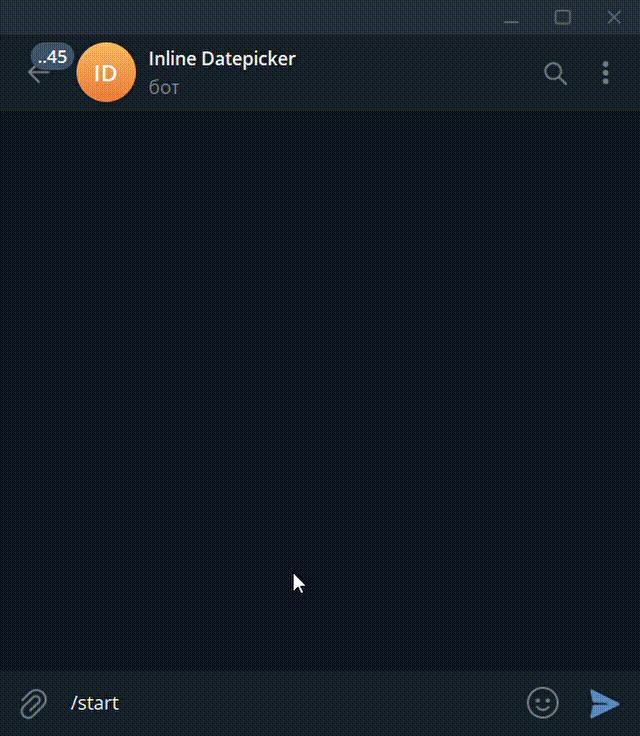

# aiogram3 Datepicker
A simple datepicker built on telegram inline keyboard.

## Usage

### Basic usage
```python
from datepicker import DatePicker, DpCallback

datepicker = DatePicker()

@dp.message(Command(commands=['start']))    # start command
async def start(message: Message):
    await message.answer(
        'Select date:', 
        reply_markup=await datepicker.start_calendar()
    )

@dp.callback_query(DpCallback.filter())
async def process_dialog_calendar(
    callback: CallbackQuery, callback_data: DpCallback
):
    date = await datepicker.process_selection(callback, callback_data)
    if date:
        await callback.message.edit_text(f"Selected date {date} ✅")
```

### Localization

To change the language in which the months and days of the week of the calendar will be written, you need to change the attribute of the Datepicker() class.
[locale docs](https://docs.python.org/3/library/locale.html)

```python
datepicker=Datepicker(locale="fr_FR") # "en_US" by default
```

### Blocked Days

You can pass to the blockedDays class attribute dates that you don't want to process or you want to visually hide them
```python
datepicker = DatePicker(
    blockedDays=[datetime.now().date()]
)

#or use append/extend instead

datepicker.blockedDays.append(datetime(2025,4,3).date())
datepicker.blockedDays.extend([datetime(2025,4,14).date(), datetime(2025,4,15).date()])
```
> Warning: Dates must be in datetime.date() format

### First day of the week

You can change which day the week starts with by using the **firstweekday** attribute
```python
datepicker = DatePicker(
    firstweekday=6 #Sunday
)
```

###Customization

```python
datepicker = DatePicker(
    locale="ru_RU",
    blockedDays=[datetime.now().date()],
    blockedButton="⛔",
    controlButtons=["⬅", "➡"],
    confirmButton="Confiiiiiirm📌",
    dateFormat="%Y-%m-%d",
    selectionFormat="🍔{}",
    placeholder="✨Your star day is "
)
```
## Datepicker attributes

|Attribute|Type |Description|Default|
|---|---|---|---|
|placeholder| string | Displays text before the date, when the oneTap attribute is disabled|"📆 Selected date: "
|oneTap| bool|If true removes the confirmation button and does not change the message text in the format ‘{placeholder} + {date}’  |"False"
| locale| string | Changes the locale of datepicker | "en_US"
| firstweekday | int (0-6) | Responsible for what day of the week the week starts from | 0 (0-Monday, 6-Sunday)
| controlButtons | list[str, str] | Appearance of the control buttons | ["<<", ">>"]
| blockedDays | list[datetime.date()] | List of days that cannot be selected | [ ]
| blockedButton | string | Appearance of the button with blocked days | "❌"
| emptyButton | string | Appearance of an empty button | "ㅤ" (u+3164)
| dateFormat | string | Output value date [format](https://docs.python.org/3/library/datetime.html#strftime-and-strptime-behavior) | "%d.%m.%Y"
| yearRange | int | Date display boundaries based on the current year | 120
| confirmButton | string | Appearance of the confirmation button | "Confirm ✅"
| selectionFormat | string | Selected day/month/year [format](https://docs.python.org/3/library/stdtypes.html#str.format) |  "〔{}〕"
| predefined| datetime | Predefined date when datepicker is opened | None
